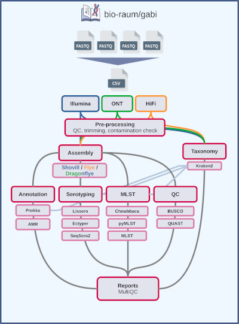

# bio-raum/gabi

**G**enomic **A**nalysis of **B**acterial **I**solates, or GABI for short, is a bioinformatic workflow to assemble bacterial genomes, annotate genes, detect antimicrobial resistance genes as well assign them to an (cg)MLST clustering schema. GABI supports both (Illumina) short reads and ONT/Pacbio long reads. Hybrid assembly approaches are supported for ONT/Illumina data sets and require for different read types to carry the same sample ID for grouping. Please see our [documentation](docs/usage.md) for detailed information.  

If you are really impatient, check out our [quickstart](docs/quickstart.md) guide. 

## Documentation 

1. [What happens in this pipeline?](docs/pipeline.md)
2. [Installation and configuration](docs/installation.md)
3. [Running the pipeline](docs/usage.md)
4. [Output](docs/output.md)
5. [Software](docs/software.md)
5. [Troubleshooting](docs/troubleshooting.md)
6. [Developer guide](docs/developer.md)

## Developer team

FooDMe2 is developed and supported by the following people and organizations:

[Marc Höppner](https://github.com/marchoeppner), Landeslabor Schleswig-Holstein, [LSH](https://www.schleswig-holstein.de/DE/landesregierung/ministerien-behoerden/LLABOR)

## Acknowledgements

We thank the developers of the [AQUAMIS](https://gitlab.com/bfr_bioinformatics/AQUAMIS) pipeline for making some of the building blocks on which GABI is based publically available - specifically the ConfindR database and validation data for <i>Campylobacter spp.</i> as well as the reference intervals for a broad range of bacteria to determine assembly status. 