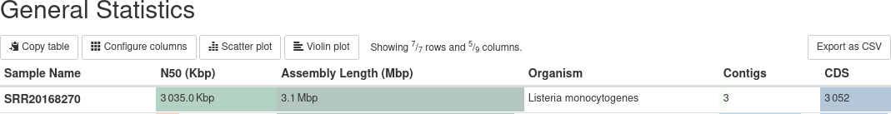
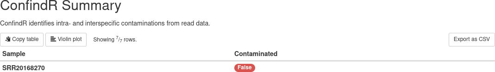
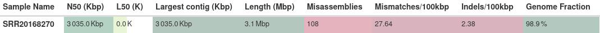
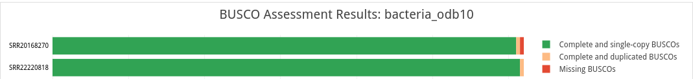
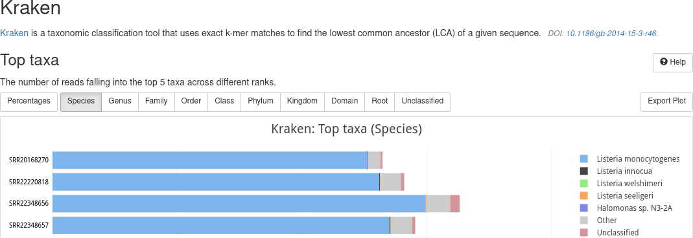

# Outputs 

## Interpreting results

Evaluating samples

### How to judge the success of a sequencing run

- Does the assembly size match known/published values for this species?
- Into how many contigs was the sample assembled?
- Are the reads potentially contaminated?
- Does the taxonomic profile suggest the presence of more than one species?
- How complete is the assembly?
- How much read coverage do we have (for each sequencing technololgy)
- How complete is the gene space coverage and are there many duplicate BUSCO hits?

You should come up with reasonable threshold for these parameters, based on your experience with your data. 

A possible set of cutoffs could be:

- No more than 150 contigs
- Contig N50 > 100kb
- Read coverage > 40X (will also depend on sequencing technologies used)
- Genome size within 5% of expected value
- Busco score > 95%
- Quast genome fraction >= 95%
- Kraken abundance: only one species > 2%

But your mileage may vary. 

#### General statistics

Basically, our goal should be to have highly contiguous assembly, without any contaminations or obvious errors. The `general statistics` section provides some immediate hints:

#### Confindr

Secondly, `ConfindR` results inform about potential contamination issues:

Samples with contamination in any of the contributing read files are listed as "true" (green). Check the sequencing-technology specific MultiQC reports to see which files raised this flag. 

#### Quast

QUAST provides some insights into the assembly quality - with some caveats concerning missamblies etc, based on the availability of a suitable reference genome against which to compare. 

Also see our [troubleshooting](troubleshooting.md) document for more explanations on the limitation of Quast as used by GABI. 

#### Busco

BUSCO identifies the presence of expected conserved bacterial genes - a good assembly should be near-complete and not contain (many) duplicated BUSCOs. 

#### Kraken

Complementary to ConfindR, Kraken can be used to check if the sample consists of more than one species. A low level of abundance is typically no reason for concern and more likely the result of low complexity sequence motifs. 

Please note that we only use the most-suitable data set per sample to run Kraken - meaning, if Illumina reads are available, those will be used over Nanopore (which has a much higher error rate). In that sense, a negative Kraken result is not a guarantee that no contamination is present. 

#### Technology-specific QC

GABI generates additional MultiQC reports for each sequencing technology. These can be used to get a few more details, for example for the ConfindR results or the technology-specific sequence coverage of the final assembly.

## Reports

Sample results

For each sample, a folder is created with results from various tools, as follows:

- amr - Predictions of antimicrobial resistance genes
  - abricate - Results from Abricate
  - amrfinderplus - Results from AMFfinderPlus
- annotation - Gene model predictions
  - prokka - Prokka annotations
- assembly - The genome assembly and related information
  - busco - Busco analysis of gene space coverage
  - quast - Quast assembly metrics
  - flye/dragonflye/shovill - the assembler output(s)
- mlst - MLST typing results
- Plamids - Identification of plasmids from the assembly
- qc - Basic read QC
  - fastqc - Quality metrics of reads
  - confindr_results - ConfindR contamination check
- taxonomy - Taxonomic profiling using raw reads
  - kraken2 - Results from Kraken2
- sample.json - A coarse summary of various sample-level results

Combined results

Some results are computed for all samples of a run, or for all samples belonging to the same species. These results are as follows:

- cgMLST - core genome MLST calls
  - chewbbaca - Results from Chewbbaca across all samples from the same species, including minimal spanning tree and distance matrix
  - pymlst - Results from pyMLST across all samples from the same species (distance matrix only)
- AMR
  - Aggregated results from supported antimicrobial resistance gene predictors

## QC

MultiQC

- run_name_multiqc_report.html - Sample-level summary
- Illumina - QC metrics relating to Illumina data
- Nanopore - QC metrics relating to Nanopore data
- Pacbio - QC metrics relating to Pacbio data

## Run metrics

pipeline_info

This folder contains the pipeline run metrics

- pipeline_dag.svg - the workflow graph (only available if GraphViz is installed)
- pipeline_report.html - the (graphical) summary of all completed tasks and their resource usage
- pipeline_report.txt - a short summary of this analysis run in text format
- pipeline_timeline.html - chronological report of compute tasks and their duration
- pipeline_trace.txt - Detailed trace log of all processes and their various metrics

