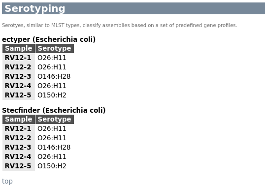

# Outputs 

## Result files

GABI produces two primary reports, as well as reports specific to each sequencing technology used. 

The key report for most users will be `reports/<run_name>.html`. This file includes all the relevant metrics describing (most of) your data and assembly, with automatic classification and highlighting of each sample status (pass, warn, fail). 

The sample status is computed based on a set of [known reference values or intervals](https://gitlab.com/bfr_bioinformatics/AQUAMIS/-/blob/master/resources/AQUAMIS_thresholds.json?ref_type=heads) for metrics such as genome size, gc content etc as well as the results from contamination checks. 

In addition to this report, GABI produces a similar output using [MultiQC](https://seqera.io/multiqc/). This report is a legacy feature since we know that a lot of people enjoy using it. Please note however that the MultiQC report is missing many of the metrics from the primary report, including the sample status.

You may find it useful to also check the platform-specific MultiQC reports in each respective subfolder to understand where some (if any) of the warnings and fails may be coming from. MultiQC is very "graphical" and makes it easy to spot individual issues across the various metrics without doing a lof of reading and "clicking around". 

## Interpreting results

<details markdown=1>
<summary>Evaluating samples</summary>

### How to judge the success of a sequencing run

- Does the assembly size match known/published values for this species?
- Into how many contigs was the sample assembled?
- Are the reads potentially contaminated?
- Does the taxonomic profile suggest the presence of more than one species?
- How complete is the assembly?
- How much read coverage do we have (for each sequencing technololgy)
- How complete is the gene space coverage and are there many duplicate BUSCO hits?

You should come up with reasonable threshold for these parameters, based on your experience with your data. GABI will provide an interpretation for you, but it is advisable to think about the specific details. 

#### GABI summary

The summary section of the GABI report aims to provide as many details as possible in one place, with build-in sample status highlighting (green, yellow, red).


Here, each sample is represented by one row, with the sample ID (as provided in the sample sheet), the overall status, best-guess taxon, followed by metrics about the assembly, the read coverage of the assembly as well as basic read metrics and finally results from contamination-related checks. Please note that contamination checks are going to work best on Illumina data, since the basic principle depends in one way or the other on read variants. Nanopore data may occasionally yield incorrect inferences and is deliberately paramterized to suppress noisy results (which may well be true contaminations at low levels). 

In this example, the sample is shown as "pass", which means that all relevant metrics are above or within pre-defined thresholds for this species. Notable, the Q30 quality of the Illumina reads used for assembly is highlighted in yellow, which means that it is of potential concern but not a reason for an outright failure of the sample. Basically, we consider Illumina reads with a Q30 fraction of less than 85% to be a sign of potential issues, based on years of experience using the technology. But in this case, it is merely a suggestion for you to have a look at the raw data and the sequencing run to check if everything looks ok otherwise. 

You can click on any of the rows in the summary to get additional information, if available. 


#### Busco

BUSCO identifies the presence of expected conserved bacterial genes - a good assembly should be near-complete and not contain (many) duplicated BUSCOs. 


#### Bracken

Complementary to ConfindR, Kraken (combined with Bracken) can be used to check if the sample consists of more than one species. A low level of abundance is typically no reason for concern and more likely the result of low complexity sequence motifs. 


#### MLST typing

MLST typing groups isolates based on sequence "types" defined for a small number of core genes. If more than one such schema is defined for a given species, results will be split by schema (and species). You may choose whichever schema is the default in your community (if any). 


#### Serotyping

GABI performs serotyping with commonly used tools. Results will be split by taxon and tools (if multiple exist). 



#### Technology-specific QC

GABI generates additional MultiQC reports for each sequencing technology. These can be used to get a few more details, for example for the ConfindR results or the technology-specific sequence coverage of the final assembly.

</details>

## Reports

<details markdown=1>
<summary>Sample results</summary>

For each sample, a folder is created with results from various tools, as follows:

- amr - Predictions of antimicrobial resistance genes
  - abricate - Results from Abricate
  - amrfinderplus - Results from AMFfinderPlus
- annotation - Gene model predictions
  - prokka - Prokka annotations
- assembly - The genome assembly and related information
  - busco - Busco analysis of gene space coverage
  - quast - Quast assembly metrics
  - flye/dragonflye/shovill - the assembler output(s)
- mlst - MLST typing results
- plasmids - Identification of plasmids from the assembly
- qc - Basic read QC
  - fastqc - Quality metrics of reads
  - confindr_results - ConfindR contamination check
- taxonomy - Taxonomic profiling using raw reads
  - kraken2 - Results from Kraken2/Bracken
- sample.json - A comprehensive summary of various sample-level results - can be used to roll your own reporting formats or tie into downstream data processing. 
- sample.qc.json - The same JSON as above, with added QC vote

```JSON
 "qc": {
        "fail": [],
        "warn": [
            "confindr_illumina"
        ],
        "pass": [
            "fastp_q30_rate",
            "taxon_illumina_count",
            "quast_assembly",
            "quast_contigs",
            "quast_n50",
            "quast_gc",
            "quast_duplication",
            "busco_completeness",
            "busco_duplicates",
            "coverage_illumina_mean",
            "coverage_total_mean",
            "coverage_illumina_40x",
            "coverage_total_40x"
        ],
        "missing": [
            "confindr_nanopore"
        ],
        "messages": [
            "Low levels of contamination (inter-species) detected in illumina reads S01-R1-1"
        ],
        "call": "warn"
    }
```

</details>

<details markdown=1>
<summary>Combined results</summary>

Some results are computed for all samples of a run, or for all samples belonging to the same species. These results are as follows:

- AMR
  - Aggregated results from supported antimicrobial resistance gene predictors

</details>

## QC

<details markdown=1>
<summary>MultiQC</summary>

- run_name_multiqc_report.html - Sample-level summary
- Illumina - QC metrics relating to Illumina data
- Nanopore - QC metrics relating to Nanopore data
- Pacbio - QC metrics relating to Pacbio data

</details>

## Run metrics

<details markdown=1>
<summary>pipeline_info</summary>

This folder contains the pipeline run metrics

- pipeline_dag.svg - the workflow graph (only available if GraphViz is installed)
- pipeline_report.html - the (graphical) summary of all completed tasks and their resource usage
- pipeline_report.txt - a short summary of this analysis run and all parameters, in text format
- pipeline_timeline.html - chronological report of compute tasks and their duration
- pipeline_trace.txt - Detailed trace log of all processes and their various metrics

</details>

## Software versions
<details markdown=1>
<summary>Report</summary>

GABI emits the version of all the tools it used in a given pipeline run at the end of the primary reports. 


</details>