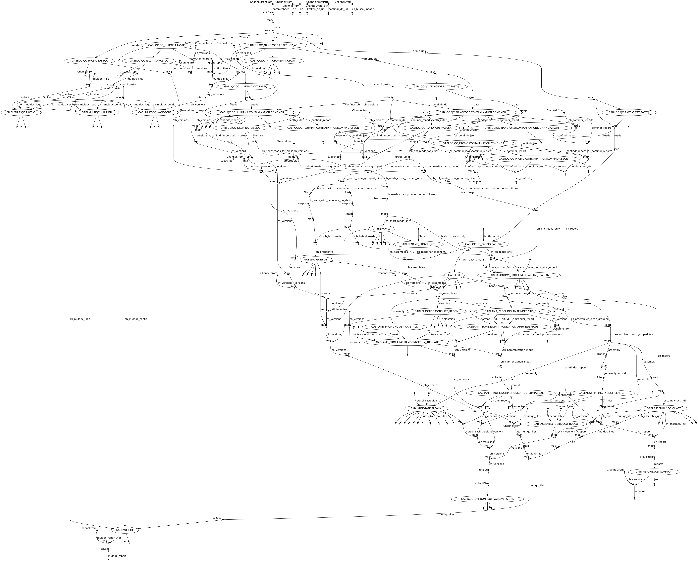

# Pipeline structure

Now, that looks very complex - and indeed it is. But we can break it down into a few key steps:

- Perform quality control of the read data, and merge libraries across lanes
- Group read data by sample id and check which assembly tool is appropriate based on the types of sequencing data we have available
- Assemble reads with the optimal tool
- Determine the species from the assembled genome sequence
- Perform quality checks on the assembly
- Perform genomic serotyping, if we have suitable tools available for that species
- Perform MLST typing on the assembly, if we have a pre-configured database for that species
- Annotate gene models in our assembled genome
- Predict antimicrobial resistance genes from our annotation
- Make a "pretty" QC report

# Does GABI distinguish between chromosomal assembly and "full" assembly, and what does that even mean?

Yes, GABI does make that distinction - meaning that some parts of the pipeline see the assembly with all the contigs, and some others only see the bits of the assembly that are likely to represent the bacterial chromosomes (without plasmids). 

| Pipeline section | Assembly used|
|------------------|--------------|
| AMR profiling    | All contigs  |
| MLST profiling   | All contigs  |
| Annotation       | All contigs  |
| Serotyping       | All contigs  |
| Reference genome | Chromosomes  |
| Variant calling  | Chromosomes  |
| Coverages        | All contigs  |
| Assembly QC      | Chromosomes  |

Why are we doing this? Basically, steps like idenfying the best reference genome match should not include plasmids, since these could throw off the algorithm. Likewise, if we want to know how complete our assembly is, this should ideally only include the chromosomes since the plasmids are generally "fluid" and not part of the "core" genome. That said, for most analysis steps, the entire assembly is used since the entire "biochemistry" of an isolate is determined by all the genes in the cell, not just those on the chromosomes. 
