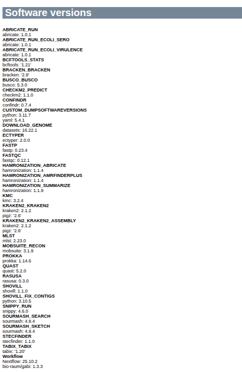

# Outputs 

## Reports 

### HTML

`reports/name_of_pipeline_run.html`: A graphical summary of all samples in this analysis run. Some of the information you can gather from this include

- Does the assembly size match known/published values for this species?
- Into how many contigs was the sample assembled?
- Are the reads potentially contaminated?
- Does the taxonomic profile suggest the presence of more than one species?
- How complete is the assembly?
- How much read coverage do we have (for each sequencing technololgy)
- How complete is the gene space coverage and are there many duplicate BUSCO hits?

You should come up with reasonable threshold for these parameters, based on your experience with your data. GABI will provide an interpretation for you, but it is advisable to think about the specific details. 

=== "Summary"

  

  Here, each sample is represented by one row, with the sample ID (as provided in the sample sheet), the overall status, best-guess taxon, followed by metrics about the assembly, the read coverage of the assembly as well as basic read metrics and finally results from contamination-related checks. Please note that contamination checks are going to work best on Illumina data, since the basic principle depends in one way or the other on read variants. Nanopore data may occasionally yield incorrect inferences and is deliberately paramterized to suppress noisy results (which may well be true contaminations at low levels). 

  You can click on any of the rows in the summary to get additional information, if available. 

=== "Busco"

  BUSCO identifies the presence of expected conserved bacterial genes - a good assembly should be near-complete and not contain (many) duplicated BUSCOs. 

  

=== "Bracken"

  Complementary to ConfindR, Kraken (combined with Bracken) can be used to check if the sample consists of more than one species. A low level of abundance is typically no reason for concern and more likely the result of low complexity sequence motifs. 

  

=== "Characterization"

  Assemblies may be used to bioinforamtically characterize the isolate, for example to determine the MLST type, Serotype or presence of antimicrobial resistance genes (AMR). GABI summarizes this information in a concise table. 

  

### JSON 

All results (per sample) are summarized in a JSON file (`results/sample/MySample/MySample.qc.json`), which roughly mirrors the organizational hierarchy of the folder structure described below. 

In addition , it contains a section with the overall QC vote and a list of parameters and the QC category (pass, warn, fail, missing) they were assigned to. 

```JSON
 "qc": {
        "fail": [],
        "warn": [
            "confindr_illumina"
        ],
        "pass": [
            "fastp_q30_rate",
            "taxon_illumina_count",
            "quast_assembly",
            "quast_contigs",
            "quast_n50",
            "quast_gc",
            "quast_duplication",
            "busco_completeness",
            "busco_duplicates",
            "coverage_illumina_mean",
            "coverage_total_mean",
            "coverage_illumina_40x",
            "coverage_total_40x"
        ],
        "missing": [
            "confindr_nanopore"
        ],
        "messages": [
            "Low levels of contamination (inter-species) detected in illumina reads S01-R1-1"
        ],
        "call": "warn"
    }
```

### Technology-specific QC

GABI generates additional MultiQC reports for each sequencing technology (stored under `reports/`). These can be used to get a few more details, for example for the ConfindR results or the technology-specific sequence coverage of the final assembly.

## Data structure

For each sample, a folder is created with results from various tools, as follows:

- amr - Predictions of antimicrobial resistance genes
  - abricate - Results from Abricate
  - amrfinderplus - Results from AMFfinderPlus
- annotation - Gene model predictions
  - prokka - Prokka annotations
- assembly - The genome assembly and related information
  - busco - Busco analysis of gene space coverage
  - quast - Quast assembly metrics
  - flye/dragonflye/shovill - the assembler output(s)
- mlst - MLST typing results
- plasmids - Identification of plasmids from the assembly
- qc - Basic read QC
  - fastqc - Quality metrics of reads
  - confindr_results - ConfindR contamination check
- serotyping
  - Results per serotyping tool (if any)
- taxonomy - Taxonomic profiling using raw reads
  - kraken2 - Results from Kraken2/Bracken
- sample.qc.json - The main results in JSON format, with QC vote for individual parameters and the overall sample ("call")

## Run metrics

The folder `pipeline_metrics` contains the pipeline run metrics

- pipeline_dag.svg - the workflow graph (only available if GraphViz is installed)
- pipeline_report.html - the (graphical) summary of all completed tasks and their resource usage
- pipeline_report.txt - a short summary of this analysis run and all parameters, in text format
- pipeline_timeline.html - chronological report of compute tasks and their duration
- pipeline_trace.txt - Detailed trace log of all processes and their various metrics

## Software versions

GABI emits the version of all the tools it used in a given pipeline run at the end of the primary reports. 


